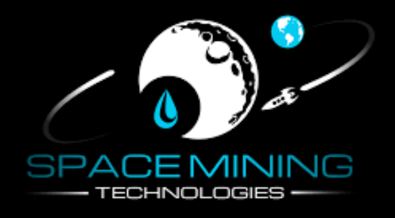

# Space Mining Technologies



## Description

Space Mining Technologiese is a platform where users can upload and view images of asteroids. This unique platform offers an opportunity for users to potentially earn a share of the profits by having their uploaded pictures selected for the next mining operation.

The website allows users to create an account and upload images of asteroids they have encountered or discovered. These images are then reviewed by experts to determine their suitability for future mining operations. If a user's uploaded image is chosen for mining, they will be eligible to receive a share of the profits generated from the successful mission.

Additionally, the website provides an option for users to become miners themselves. In the "Contact Us" section, users can provide their details and express their interest in becoming a miner. The company will review the submitted information and contact the interested individuals to discuss potential opportunities.

Space Mining Technologies aims to create an engaging community of space enthusiasts, while also providing real-world opportunities for users to participate in the exciting field of asteroid mining.

## Table of Contents

- [Prerequisites](#prerequisites)
- [Setup and Installation](#setup-and-installation)
  - [Using venv (Virtual Environment)](#using-venv-virtual-environment)
  - [Using Docker](#using-docker)
- [Documentation](#documentation)
- [Contributing](#contributing)
- [License](#license)
- [Acknowledgements](#acknowledgements)
- [Contact](#contact)

## Prerequisites

- Python 3.x
- Docker

## Setup and Installation

### Using venv (Virtual Environment)

1. Clone the repository:
  git clone [repository_url](https://github.com/the-mighty-ashura/Capstone_Django/tree/master)


2. Navigate to the project directory:
  cd <project_directory>


3. Create a virtual environment:
  python -m venv venv


4. Activate the virtual environment:
- On Windows:
  ```
  venv\Scripts\activate
  ```
- On macOS/Linux:
  ```
  source venv/bin/activate
  ```

5. Install dependencies:
  pip install -r requirements.txt


6. Run the Django development server:
  python manage.py runserver


7. Access the application in your web browser at `http://localhost:8000`.

### Using Docker

1. Clone the repository:
  git clone [repository_url](https://github.com/the-mighty-ashura/Capstone_Django/tree/master)


2. Navigate to the project directory:
  cd <project_directory>


3. Build the Docker image:
  docker build -t project-name .


4. Run the Docker container:
  docker run -p 8000:8000 project-name


5. Access the application in your web browser at `http://localhost:8000`.


## Documentation

To access the project documentation, please visit the [Sphinx Documentation](asteroidmining/docs/_build/html/index.html).


## Contributing

Thank you for considering contributing to the AsteroidMining Company Website! We welcome any contributions that can help improve the platform and enhance the user experience. To contribute, please follow these guidelines:

1. Fork the repository and create your own branch for the feature/bug fix you plan to work on.

2. Make your changes in the codebase, ensuring that your code follows our coding conventions and best practices.

3. Write clear and concise commit messages explaining the purpose and scope of your changes.

4. Test your changes thoroughly to ensure they do not introduce any regressions or break existing functionality.

5. Submit a pull request from your branch to the main repository's `master` branch. Provide a detailed description of your changes and any relevant information that would help with the review process.

6. Our team will review your pull request, provide feedback, and work with you to address any necessary changes.

Please note that we have a code of conduct in place and we expect all contributors to adhere to it. By participating in this project, you agree to abide by the code of conduct.

We appreciate your time and effort in contributing to the AsteroidMining Company Website. Together, we can make this platform even better!


## License

The AsteroidMining Company Website is licensed under the [MIT License](https://opensource.org/licenses/MIT). This means that you have the freedom to use, modify, and distribute the codebase for both commercial and non-commercial purposes. However, we provide no warranty or guarantee of any kind, and the contributors of this project shall not be held liable for any damages or liabilities arising from the use of the software.

We encourage you to review the full text of the [MIT License](https://opensource.org/licenses/MIT) to understand your rights and responsibilities when using this software.

Please note that any contributions you make to this project will also be licensed under the same [MIT License](https://opensource.org/licenses/MIT) terms.

If you have any questions regarding the license or usage of this software, please feel free to reach out to us.


## Acknowledgements

We would like to express our gratitude to the following individuals and organizations for their contributions, resources, and support:

- [HyperionDev](https://www.hyperiondev.com) - A special thank you to HyperionDev for their assistance and guidance throughout the development of this Django project. Their expertise and resources have been invaluable in helping us build and deploy this website.

- [Django](https://www.djangoproject.com) - We are grateful to the Django community for creating and maintaining such a powerful and flexible web framework. Their extensive documentation and active community support have been instrumental in the development of this project.

## Contact

For any inquiries, suggestions, or feedback, please feel free to reach out to us:

- Email: gerhardus321@protonmail.com

We appreciate your interest and will get back to you as soon as possible.
